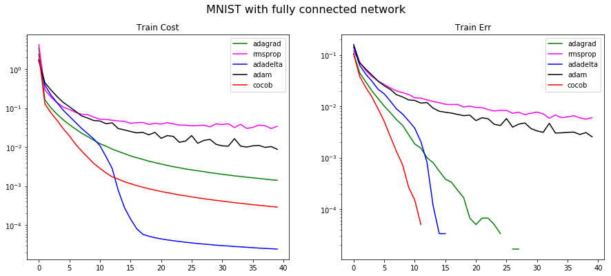
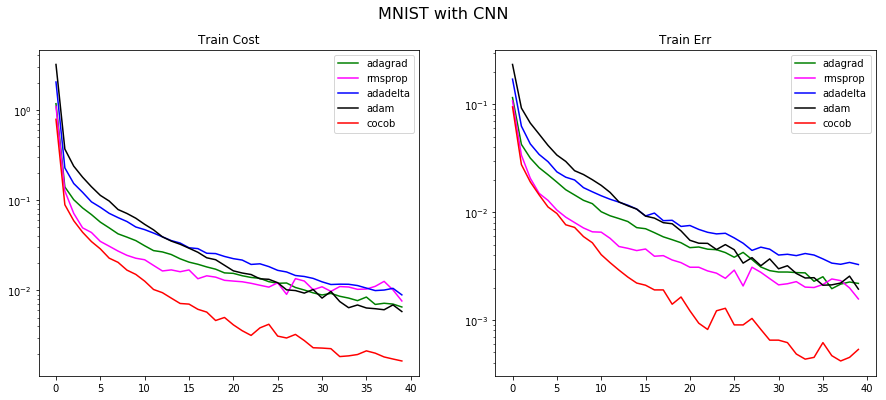
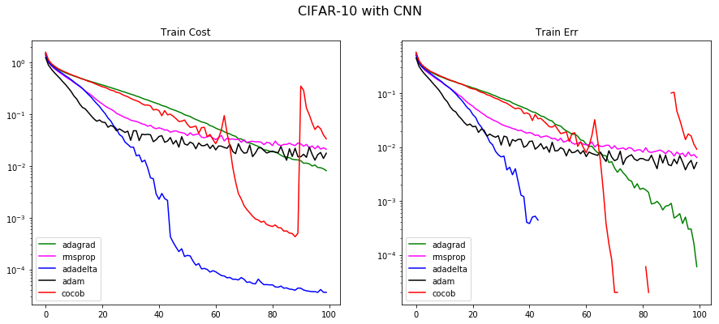
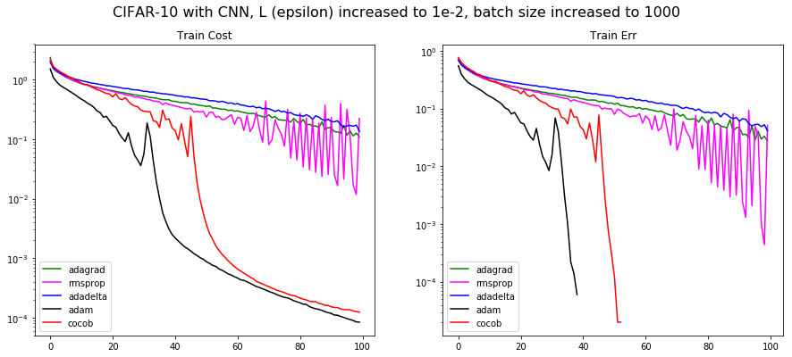
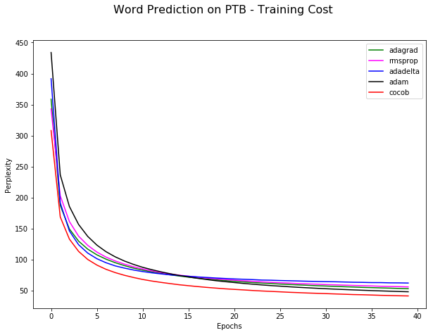
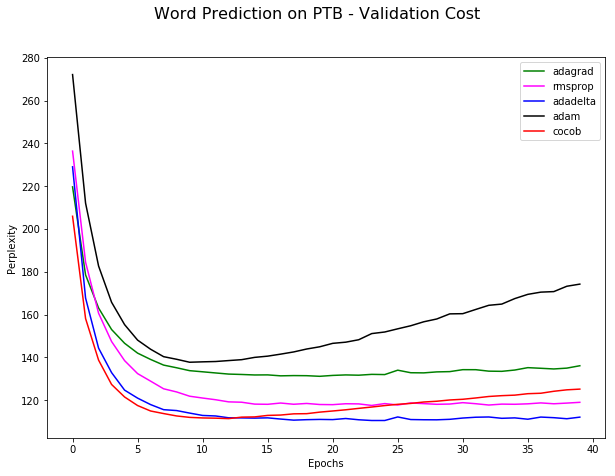

# nips.cocob.implementation
PyTorch implementation of the NIPS'17 paper `Training Deep Networks without Learning Rates Through Coin Betting`.

Paper: [https://arxiv.org/abs/1705.07795](https://arxiv.org/abs/1705.07795) by Francesco Orabona, Tatiana Tommasi

Paper being validated by [Anand Saha](http://teleported.in/about/about/) as part of [NIPS paper implementation challenge](https://nurture.ai/nips-challenge/).

### Files:

* cocob.py: The optimizer in PyTorch
* cocob_report.ipynb: Notebook where the fully connected and CNN based models were tested on the various optimizers including cocob.
* word_language_model/: The LSTM model from [PyTorch examples](https://github.com/pytorch/examples/tree/master/word_language_model) where the Penn Tree Bank corpus was tested on various optimizers including cocob.

### Findings:

**The positives**

* Very promising optimizer. Not having to decide the learning rate was refreshing change.
* The trends I got matched with the paper with some caveats mentioned below in _concerns_, but are not as smooth as the paper's
* In most cases, COCOB performed better than other optimizers but is yet to be battle tested.

**The concerns**

* It has more tensor operations than other optimizers. It does poorly on performance if batchsize is less (~100 in my case) and take almost 30-50% more time than the next expensive optimizer. However on increasing the batch size, it's performance came at par. 
* I found it is sensitive to batch size, and somehow overfits easily if batch size is increased. This behaviour is not seen in other optimizers. (See 'Other Experiments' in the notebook `cocob_report.ipynb`) To compensave for that, I increased the 'L' or _epsilon_ value (a hyper parameter in itself). I got better results in the CIFAR-10 case by increasing this value (see below). Might be a case where we are replacing one hyperparameter with another?

### Notes on the experiments:

* The authors showed results only on the training set. I have included the results on validation set as well to understand how well it generalized, which can be seen in the notebook `cocob_report.ipynb`
* What the authors call the _Test err_ is nothing but `1 - accuracy` obtained on the Training set (and not test set). Hence I mark it as _Train Err_ instead of _Test Err_.
* There were some minor differences in the models used by me vs the authors. However I think that should not matter because this is a comparison of the optimizers on a common model. The differences are:
    * For weights initialization, I used samples from normal distribution or xavier initialization rather than truncated_normal. PyTorch doesn't have the TensorFlow equivalent of truncated_normal, and I did not spend time in implementing it.
    * For CIFAR-10 on CNN, I used BatchNorm and did not use LRN as was used by the author's model. PyTorch doesn't have LRN and I did not spend time to implement it.
    * I used different learning rates for non-cocob optimizers than used by the authors so as to present all optimizers to the best of their ability, on my setup/models.
    * For the word prediction test, I used the [word_language_model](https://github.com/pytorch/examples/tree/master/word_language_model) from PyTorch examples.

### Graphs:

**`MNIST with fully connected network`**

| Optimizer | Learning rate | Time to train (sec) |
|-----------|---------------|---------------------|
| adagrad   | 0.0075        | 60.15               |
| rmsprop   | 0.001         | 60.30               |
| adadelta  | 0.1           | 66.30               |
| adam      | 0.0001        | 61.65               |
| cocob     | N/A           | 93.74               |

Batch size was 100. The Train Err is nothing but `1 - accuracy`. The graphs which shoot down actually could fit the entire training dataset, hence accuracy became 1.

**`MNIST with CNN`**

| Optimizer | Learning rate | Time to train (sec) |
|-----------|---------------|---------------------|
| adagrad   | 0.0075        | 112.79              |
| rmsprop   | 0.001         | 115.27              |
| adadelta  | 0.1           | 128.51              |
| adam      | 0.0001        | 120.97              |
| cocob     | N/A           | 188.70              |

Batch size was 100. The Train Err is nothing but `1 - accuracy`. 

**`CIFAR-10 with CNN`**

With batchsize of 100 and L or 1e-8 (default):

| Optimizer | Learning rate | Time to train (sec) |
|-----------|---------------|---------------------|
| adagrad   | 0.01          | 471.64              |
| rmsprop   | 0.001         | 472.48              |
| adadelta  | 0.1           | 494.63              |
| adam      | 0.0001        | 480.96              |
| cocob     | N/A           | 631.81              |

The graphs which shoot down actually could fit the entire training dataset, hence accuracy became 1.

With batchsize of 1000 and L or 1e-2 (this smoothened the loss function and made cocob perform better):

| Optimizer | Learning rate | Time to train (sec) |
|-----------|---------------|---------------------|
| adagrad   | 0.01          | 324.54              |
| rmsprop   | 0.001         | 330.56              |
| adadelta  | 0.1           | 339.40              |
| adam      | 0.0001        | 334.83              |
| cocob     | N/A           | 346.53              |

The graphs which shoot down actually could fit the entire training dataset, hence accuracy became 1.

**`Word Prediction on Penn Tree Bank `**

